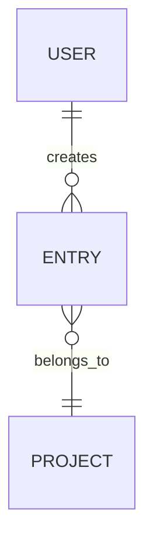

# Data Model

## Entità principali

(ER diagram o lista entità con relazioni)

```mermaid
erDiagram
  USER ||--o{ ENTRY : creates
  ENTRY }o--|| PROJECT : belongs_to
```

## Migrations

(Tool: Alembic / Prisma — dove vivono le migration)

## Note di evoluzione

-
