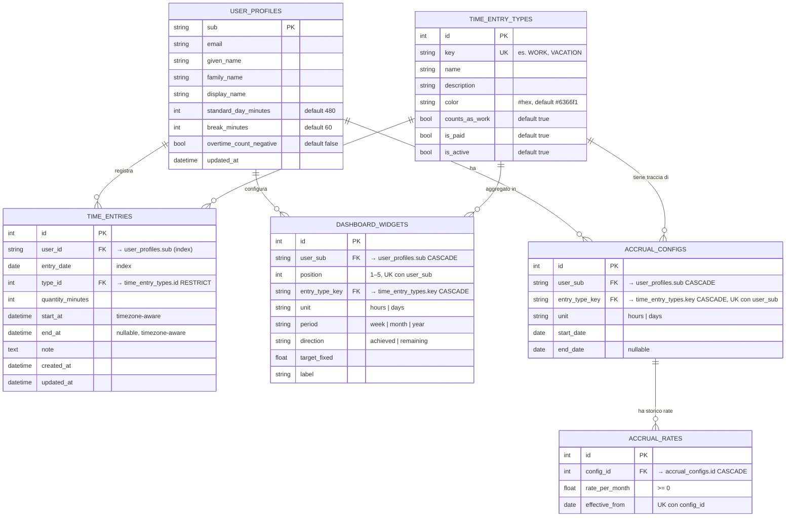

# Data Model

## Entità principali

## Descrizione entità

| Tabella | Scopo |
|---------|-------|
| `user_profiles` | Profilo utente sincronizzato da Zitadel (PK = `sub` JWT). Contiene parametri orario (giornata standard, pausa) e flag straordinari |
| `time_entry_types` | Dizionario dei tipi di voce (WORK, VACATION, …). `key` è la chiave stabile usata come FK nelle altre tabelle |
| `time_entries` | Voci di tempo. `user_id` è il `sub` Zitadel. Index composito su `(user_id, entry_date)` per query dashboard |
| `dashboard_widgets` | Fino a 5 widget per utente. Ogni widget aggrega un tipo di voce per periodo/direzione con unità configurabile |
| `accrual_configs` | Configurazione accrual (ferie, permessi) per coppia utente+tipo. Un solo record attivo per coppia (UK) |
| `accrual_rates` | Rate mensili storici per un accrual config. Più rate con `effective_from` diverso permettono storicizzazione |

## Migrations

Tool: **Alembic** — `time-ledger-py/alembic/versions/`

| Revision | Descrizione |
|----------|-------------|
| `4bc9e6d` | Init — `time_entry_types`, `time_entries` |
| `d323906` | Rename `code` → `key` su `time_entry_types` |
| `deecb62` | Check constraint formato `key` (`[A-Z0-9_]+`) |
| `7380052` | Check constraints su `time_entries` (range, valori) |
| `cc8b582` | Fix check time range entries |
| `a1f3e8b` | Aggiunge `user_id` a `time_entries` |
| `a2b3c4d` | Aggiunge nomi profilo a `user_profiles` |
| `b3c4d5e` | Aggiunge `dashboard_widgets` e `accrual_configs`/`accrual_rates` |
| `c4d5e6f` | Aggiunge impostazioni straordinari a `user_profiles` |
| `d5e6f7a` | Aggiunge `color` a `time_entry_types` |
| `e7f8a9b` | Index composito `(user_id, entry_date)` su `time_entries` |

## Note di evoluzione

- `time_entry_types.key` è diventato la FK stabile (al posto di `id`) per `dashboard_widgets` e `accrual_configs` — permette di riferirsi ai tipi per nome senza join
- Il campo `user_id` su `time_entries` è il `sub` Zitadel (stringa), non una FK su `user_profiles` — questo evita vincoli di integrità referenziale su utenti non ancora profilati
- `standard_day_minutes` default = 480 min (8h), `break_minutes` default = 60 min (pausa pranzo esclude dal calcolo straordinari)
