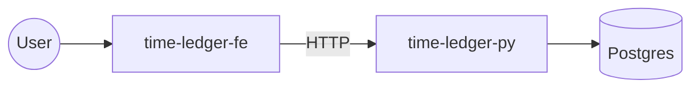

# time-ledger Overview

> [!info] Cosa è
> Cosa fa, per chi, perché esiste. (riempire con la descrizione del prodotto)

## Componenti

- **[[Frontend|time-ledger-fe]]** — (es. Next.js / React)
- **[[Backend|time-ledger-py]]** — (es. FastAPI / Flask)
- **DB** — (es. Postgres su cluster k3s)

## Diagramma

## Deploy

Vedi [[../integrations/k3s]].
