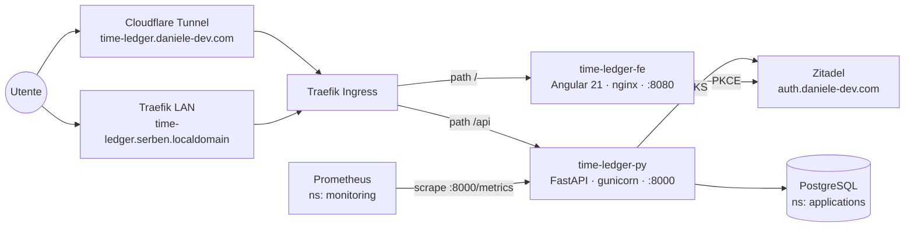

# time-ledger Overview

> [!info] Cosa è
> Applicazione full-stack per il tracciamento del tempo lavorativo. Permette di registrare voci di tempo (entry), configurare tipi di lavoro, visualizzare statistiche su un dashboard personalizzabile con widget e calcolo straordinari. Deployata sul cluster k3s e accessibile via Cloudflare Tunnel.

## Componenti

- **[[Frontend|time-ledger-fe]]** — Angular 21 SPA, autenticazione OIDC/PKCE via Zitadel
- **[[Backend|time-ledger-py]]** — Python 3.11 + FastAPI REST API, Prometheus metrics
- **DB** — PostgreSQL condiviso nel namespace `applications` del cluster k3s

## Diagramma

## Auth flow

1. Il frontend esegue Authorization Code + PKCE verso Zitadel (`auth.daniele-dev.com`)
2. L'access token JWT viene incluso in ogni richiesta al backend come `Authorization: Bearer`
3. Il backend valida la firma localmente scaricando JWKS dall'URL interno al cluster (`zitadel.applications.svc.cluster.local:8080/oauth/v2/keys`)
4. I ruoli (`admin` / user normale) vengono letti dal claim `urn:zitadel:iam:org:project:roles`

## Deploy

Vedi [[../integrations/k3s]].
