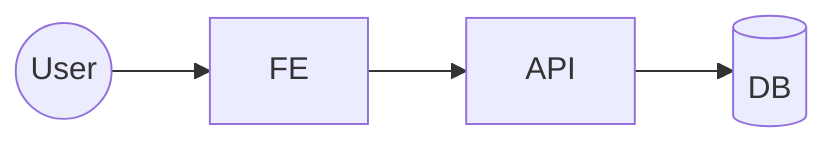

# <nome componente>

> [!info] In una riga
> Cosa fa questo componente.

## Diagramma



## Doc collegate

- [[architecture]]
- [[development]]
- [[testing]]
- [[runbooks/local-setup]]

## Stack

(versioni runtime, framework, librerie principali)

## Comandi rapidi

```bash
# es:
# npm run dev    # FE
# uvicorn ...    # BE
# npm test / pytest
# npm run build
```

## Riferimenti vault

- Architettura prodotto: [[../../_knowledge/architecture/_index]]
- Deploy cluster: [[../../_knowledge/integrations/k3s]]
