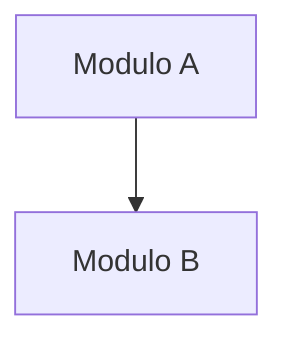

# Architettura

> [!info] Vedi anche
> [[_index]] per overview e frontmatter.

## Layout repo

```
<component>/
├── ...
```

## Diagramma


```mermaid
flowchart TD
  a[Modulo A] --> b[Modulo B]
```

## Decisioni di design

-
